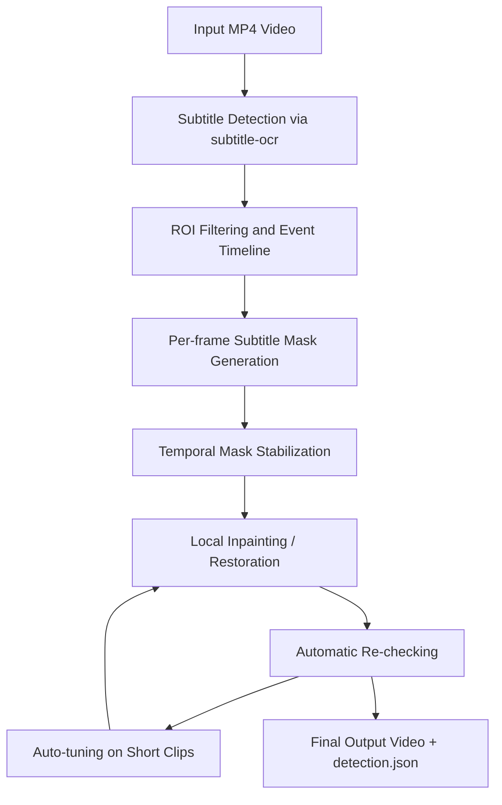
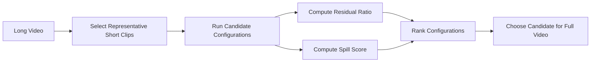
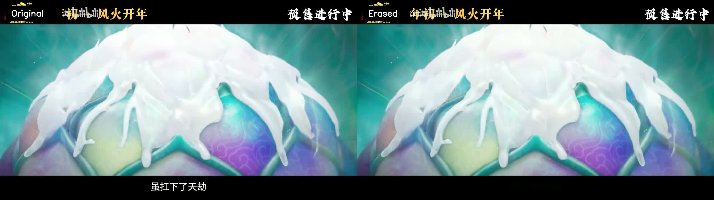
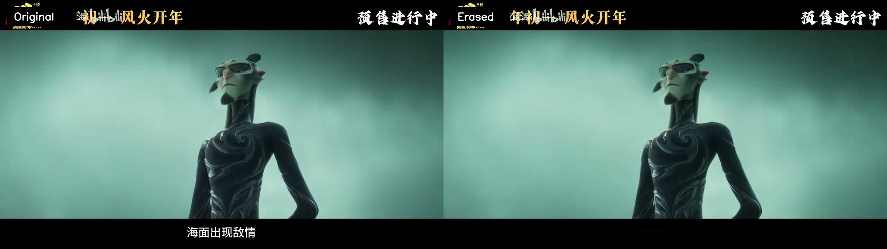

# 一种面向本地 MP4 视频的硬字幕擦除系统
# A Local MP4 Hard-Subtitle Erasure System

## 摘要 | Abstract

硬字幕擦除的核心挑战不只是“把字擦掉”，而是要同时解决字幕时间定位、像素级覆盖、视频时序稳定性以及背景修复质量之间的矛盾。本文围绕 `video-subtitle-erasure` 项目，给出一套面向本地 `mp4` 视频的工程化字幕擦除系统。该系统复用相邻 `subtitle-ocr` 项目的 OCR 与文本定位能力，构建“字幕检测、逐帧 mask 生成、局部修复、结果复检、短片段自动寻优”的处理链路。系统支持 `auto`、`semi-auto` 与 `manual-fixed` 三种工作模式，并提供一个浏览器工作台用于 ROI 标注与任务管理。实验表明，单纯依赖更强的视频补全并不能稳定提升最终观感；在当前数据集上，更可靠的路线是扩张字幕时间边界、增强时序 mask 稳定性、并以保守的局部修复后端为主。本文重点总结系统设计、实现细节与实际优化结论，为本地视频硬字幕擦除提供一套可复现的实现范式。

The core challenge of hard-subtitle erasure is not merely removing text pixels, but jointly handling subtitle timing, pixel-level coverage, temporal stability, and visual fidelity after restoration. This paper presents an engineering-oriented local hard-subtitle removal system built around the `video-subtitle-erasure` project for `mp4` videos. The system reuses OCR and text localization from the sibling `subtitle-ocr` project and implements a complete pipeline of subtitle detection, per-frame mask generation, local restoration, output re-checking, and short-clip automatic tuning. The system supports `auto`, `semi-auto`, and `manual-fixed` modes, and includes a browser workbench for ROI annotation and task management. Our experiments show that simply switching to a stronger video inpainting strategy does not reliably improve perceived quality. On the current dataset, a more robust route is to expand subtitle timing, stabilize masks temporally, and prefer a conservative local restoration backend. This paper summarizes the system design, implementation details, and practical optimization findings, offering a reproducible engineering pattern for local hard-subtitle removal.

**关键词 | Keywords**  
硬字幕擦除；视频修复；OCR；局部修补；自动寻优；时序 mask 稳定化  
Hard subtitle erasure; video restoration; OCR; local inpainting; automatic tuning; temporal mask stabilization

## 1. 引言 | Introduction

硬字幕与外挂字幕不同，它已经作为像素内容写入视频画面，因此无法通过简单关闭字幕轨道来消除。对本地视频处理系统而言，一个可用的字幕擦除方案必须至少满足四个要求：第一，能自动发现字幕出现的时间与空间位置；第二，能覆盖白字、黑边、阴影与抗锯齿边缘；第三，能在连续视频中保持时序稳定，避免闪烁与局部跳变；第四，修复结果不能大面积破坏原有场景细节。  

Unlike soft subtitles, hard subtitles are embedded directly into the video frames as pixels, so they cannot be disabled by turning off a subtitle track. For a practical local processing system, a usable subtitle-erasure pipeline must satisfy at least four requirements: it must automatically identify subtitle timing and location, cover white glyphs as well as outlines and shadows, remain temporally stable across frames, and avoid large collateral damage to the original scene.

现有工程实践里，一个常见误区是把问题单纯理解为“识别文字然后擦除文字”。然而在真实视频中，影响效果的往往不是文字内容本身，而是字幕时间边界是否足够完整、每帧 mask 是否足够精确，以及修复后是否出现明显的灰带、残边和闪烁。基于这一认识，本文不把系统设计为“全片逐帧 OCR 识别”，而是采用“检测为主、识别为辅、修复与复检闭环”的工程路线。  

A common practical misconception is to treat the problem as “recognize text and erase it.” In real videos, however, quality is more strongly determined by whether subtitle timing is complete, whether the per-frame mask is accurate, and whether restoration introduces visible blur bands, residual edges, or flicker. Based on this observation, our system is not designed as full-video frame-by-frame OCR recognition. Instead, it follows a detection-first, recognition-assisted, restoration-and-rechecking loop.

## 2. 系统概述 | System Overview

本文系统由五个主要层次组成：ROI 选择层、字幕时间定位层、逐帧 mask 生成层、局部修复层与自动评估层。整体目标是在保证本地可运行和可调试的前提下，尽量降低字幕残留与背景误改动。  

The system is organized into five major layers: ROI selection, subtitle timing localization, per-frame mask generation, local restoration, and automatic evaluation. The overall goal is to minimize subtitle residue and collateral scene damage while remaining fully local and debuggable.

*图 1 / Figure 1. 系统处理流程 / Overall system processing pipeline.*

## 3. 交互与工作模式 | Interaction and Operating Modes

系统同时支持三种模式：`auto`、`semi-auto` 与 `manual-fixed`。`auto` 适用于用户不希望手动介入的场景，系统自动发现字幕区域并执行整条处理链；`semi-auto` 允许用户先给出若干 ROI，再在 ROI 内自动做字幕时间和空间定位；`manual-fixed` 则面向字幕带长期固定的视频，在指定区域内强制执行处理。  

The system supports three modes: `auto`, `semi-auto`, and `manual-fixed`. `auto` is designed for minimal user intervention. `semi-auto` allows the user to specify one or more ROI boxes while keeping automatic timing and mask generation inside those regions. `manual-fixed` is designed for videos whose subtitle band remains largely fixed, enforcing processing inside a user-specified region.

浏览器工作台将“时间定位”和“空间标注”分离：左侧或上方播放器用于播放与拖动时间轴，独立的静态标注板用于框选 ROI，从而避免标注层拦截视频控件的问题。该设计让用户可以先定位到有字幕的帧，再精确标注字幕带。  

The browser workbench separates timeline navigation from spatial annotation: the video player is used for playback and scrubbing, while an independent static annotation board is used to draw ROI boxes. This avoids the common issue where an overlay intercepts the native controls. Users can first locate a subtitle frame and then precisely annotate the subtitle band.

*图 2 / Figure 2. 浏览器工作台，用于视频预览、ROI 标注与任务处理 / Browser workbench for video preview, ROI annotation, and task execution.*

## 4. 方法设计 | Method

### 4.1 字幕时间定位 | Subtitle Timing Localization

系统复用 `subtitle-ocr` 的检测结果生成字幕事件。每个事件包含开始帧、结束帧、文本框、置信度以及可选多边形。仅靠抽样检测往往会导致字幕真实出现时间长于检测时间，因此系统允许对字幕片段前后进行边界扩张，缓解字幕刚出现和刚消失时的漏擦问题。  

The system reuses subtitle events from `subtitle-ocr`. Each event contains a start frame, end frame, bounding box, confidence score, and optional polygon. Sampling-based detection often underestimates the true subtitle duration, so the system expands event boundaries forward and backward to reduce misses at the beginning and end of subtitle visibility.

### 4.2 逐帧 mask 生成 | Per-frame Mask Generation

在单帧内，系统不只依赖 OCR 框，而是结合亮度阈值、边缘信息与连通域过滤生成细粒度字幕 mask。对于 `manual-fixed` 和 `semi-auto` 模式，系统会把候选 mask 限制在用户指定的区域中，减少无关区域误检。  

Within each frame, the system does not rely solely on OCR boxes. It combines brightness thresholds, edge cues, and connected-component filtering to derive a finer subtitle mask. Under `manual-fixed` and `semi-auto`, the candidate mask is restricted to user-defined regions to reduce irrelevant detections.

### 4.3 时序 mask 稳定化 | Temporal Mask Stabilization

字幕在连续帧中通常具有较强的时间一致性。系统通过 `mask_temporal_radius` 把相邻帧的 mask 传播到当前帧，并做闭运算与连接，以减少字形描边、抗锯齿边缘以及帧间轻微波动导致的残留。  

Hard subtitles usually exhibit strong temporal consistency across neighboring frames. The system uses `mask_temporal_radius` to propagate masks from neighboring frames and then applies morphological closing and linking. This reduces residue caused by anti-aliased edges, outlines, and minor inter-frame fluctuations.

### 4.4 局部修复 | Local Restoration

修复层目前提供两条路径：`telea` 与 `flow-guided`。`telea` 更快、更稳定，适合作为基础路径；`flow-guided` 会尝试借助邻近帧内容做时序补全，但只有在参考帧足够一致时才会介入，否则容易在人物前景和反光区域留下灰带。当前实现通过“参考帧最小共识数量”和“像素级方差阈值”约束 `flow-guided` 的使用范围。  

The restoration layer currently provides two paths: `telea` and `flow-guided`. `telea` is faster and more stable, making it suitable as the baseline. `flow-guided` tries to exploit neighboring frames for temporal filling, but it is only allowed when reference frames are sufficiently consistent; otherwise it may introduce gray bands over foreground subjects or reflective surfaces. The current implementation constrains `flow-guided` using a minimum reference consensus and a pixel-level variance threshold.

### 4.5 自动评估与自动寻优 | Automatic Evaluation and Automatic Tuning

自动评估从两个维度衡量结果：一是输出视频里仍被 OCR 识别到的字幕残留比例；二是字幕带外区域被意外修改的程度。自动寻优则先从长视频中选择代表性短片段，对多个候选配置执行局部渲染，再用评估分数排序。  

Automatic evaluation measures the output along two axes: the amount of subtitle residue still recognized by OCR, and the amount of unintended modification outside the subtitle band. Automatic tuning first extracts representative short clips from a long video, renders candidate configurations on those clips, and ranks them by the evaluation score.

*图 3 / Figure 3. 自动评估与自动寻优闭环 / Automatic evaluation and tuning loop.*

## 5. 实验设置 | Experimental Setup

实验主要围绕两类素材开展：其一是用于 README 展示的 `哪吒预告片.mp4` 片段，用于观察常规字幕场景；其二是仓库自带长视频 `test_video/我在迪拜等你.mp4`，用于检验整片处理的稳定性。实验目标不是追求单一数值最优，而是在“字幕残留”和“背景破坏”之间寻找更稳的平衡。  

Experiments were conducted on two categories of material: clips from `哪吒预告片.mp4`, which are used for README demonstration and represent common subtitle scenes, and the bundled long-form sample `test_video/我在迪拜等你.mp4`, which is used to validate full-video stability. The goal is not to optimize a single scalar metric, but to strike a stable balance between subtitle residue and collateral scene damage.

在长视频测试中，本文重点关注三类困难场景：前景人物压住字幕带、地面或玻璃强反光、以及暗场高对比字幕。这些场景能够较好地区分“擦得更干净”和“看起来更自然”之间的差异。  

In the long-video setting, we focus on three challenging scene types: subtitles overlapping foreground subjects, subtitles over strong reflections on the floor or glass, and subtitles in dark high-contrast scenes. These cases reveal the difference between “removing more text” and “looking more natural.”

## 6. 可视化结果 | Visual Results

下面两组示例图展示了本系统在本地视频上的处理效果。左侧为带硬字幕的原始帧，右侧为擦除后的结果。  

The following examples show visual results on local videos. The left side is the original frame with hard subtitles, and the right side is the processed frame after subtitle removal.

*图 4 / Figure 4. `哪吒预告片.mp4` 片段示例 A / Example A from `哪吒预告片.mp4`.*

*图 5 / Figure 5. `哪吒预告片.mp4` 片段示例 B / Example B from `哪吒预告片.mp4`.*

从这些结果可以观察到，普通底部字幕在局部修复下可以较平稳地被移除；而在更复杂的长视频场景中，修复质量与时间边界、mask 完整性以及修复后端之间的相互作用更加明显。  

These results show that ordinary bottom subtitles can be removed relatively cleanly through local restoration. In more complex long-video scenes, however, the final quality is strongly influenced by the interaction among timing completeness, mask quality, and restoration strategy.

## 7. 讨论 | Discussion

本系统的一个关键经验是：更强的补全策略不必然对应更好的最终视频。对当前测试视频而言，`flow-guided` 在部分片段上确实能进一步降低 OCR 复检到的残字，但同时更容易在人物衣物、反光地面和暗场区域留下不自然的模糊痕迹。因此，工程上更可靠的路径是先解决时间召回和空间 mask 召回，再谨慎地引入更重的时序补全。  

A key practical finding of this system is that a stronger restoration strategy does not necessarily produce a better final video. On the current test video, `flow-guided` can indeed reduce OCR-detected residue on some clips, but it is also more likely to leave unnatural blur patterns on clothing, reflective floors, and dark scenes. Therefore, the more reliable engineering path is to solve timing recall and mask recall first, and only then introduce stronger temporal restoration carefully.

另一个经验是，自动评估很有用，但不应成为唯一裁判。OCR 复检能够有效衡量残字，却不足以完整表达主观观感；字幕带外的误修改惩罚可以缓解这一问题，但仍无法完全代替人工抽查。因此，自动评估更适合作为候选配置筛选器，而不是最终决策者。  

Another practical lesson is that automatic evaluation is useful but should not be treated as the sole judge. OCR-based re-checking effectively measures residue, yet it does not fully represent human perception. Penalizing modifications outside the subtitle band helps, but still cannot completely replace visual inspection. Automatic evaluation is therefore best used as a candidate filter rather than the final decision maker.

## 8. 结论 | Conclusion

本文给出了一套面向本地 `mp4` 视频的硬字幕擦除系统实现，并围绕其检测、mask、修复与自动评估机制进行了系统性说明。实验与优化过程表明，字幕擦除并不是单一修复模型问题，而是时间边界、像素覆盖、时序稳定性与主观视觉质量共同作用的结果。当前系统已经能够在本地完成可复现的整片字幕擦除，并通过自动评估与短片段寻优提升迭代效率。未来的工作可以继续围绕暗场残痕处理、更强的视频补全后端接入，以及更细粒度的局部重跑策略展开。  

This paper presented a local hard-subtitle erasure system for `mp4` videos and systematically described its detection, masking, restoration, and automatic evaluation mechanisms. Our experiments and optimization process show that subtitle erasure is not merely a restoration-model problem, but the result of interactions among temporal completeness, pixel coverage, temporal stability, and perceived visual quality. The current system can already perform reproducible full-video hard-subtitle removal locally, while automatic evaluation and short-clip tuning improve iteration efficiency. Future work may further address dark-scene artifacts, integrate stronger video restoration backends, and support finer-grained local re-run strategies.

## 参考实现 | Implementation References

- `subtitle_eraser/detection.py`
- `subtitle_eraser/masking.py`
- `subtitle_eraser/inpaint.py`
- `subtitle_eraser/evaluation.py`
- `subtitle_eraser/autotune.py`
- `subtitle_eraser/video.py`
